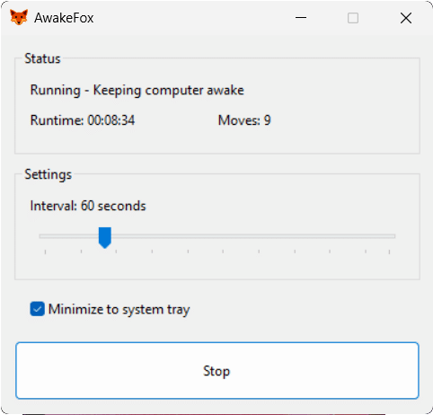

# AwakeFox 🦊

[](https://opensource.org/licenses/MIT)
[](https://www.microsoft.com/windows)
[](https://isocpp.org/)
[](https://www.virustotal.com/gui/file/bf6007053ac78c1df8c5a0300df4b4a04c289107e03d3d15aa56a1e9c7d368fc)

A lightweight Windows utility that keeps your computer awake by periodically moving the mouse cursor.

## Features

- **Minimal footprint**: ~200-300KB executable with no dependencies
- **System tray support**: Minimize to tray and run in background
- **Adjustable interval**: 10-300 seconds between movements
- **Clean GUI**: Native Windows dialog with modern visual styles
- **Settings persistence**: Remembers your preferences via Windows Registry
- **DPI aware**: Looks sharp on high-DPI displays

## Screenshot



## Building

### Requirements

- Visual Studio 2022 (any edition)
- Windows SDK 10.0 or later

### Build Steps

1. Open `AwakeFox.sln` in Visual Studio 2022
2. Select **Release | x64** (or x86 for 32-bit)
3. Build → Build Solution (Ctrl+Shift+B)
4. Find the executable in `bin/Release/x64/AwakeFox.exe`

### Icon

The icon is included in `AwakeFox/res/icon.ico`. If you want to replace it, use an ICO file with multiple sizes: 16x16, 32x32, 48x48, 256x256.

## Usage

1. Run `AwakeFox.exe`
2. Adjust the interval using the slider (default: 60 seconds)
3. Click **Start** to begin keeping your computer awake
4. Minimize to system tray to run in background
5. Right-click tray icon for quick access menu

## How It Works

AwakeFox prevents your computer from going to sleep by moving the mouse cursor by 1 pixel and immediately moving it back. This is imperceptible to users but keeps the system active.

The movement uses the Windows `mouse_event` API with relative coordinates, so your cursor position remains unchanged.

## Settings

Settings are stored in the Windows Registry at:
```
HKEY_CURRENT_USER\Software\JustFox\AwakeFox
```

- `Interval` (DWORD): Seconds between movements
- `MinimizeToTray` (DWORD): Whether to minimize to tray on close

## License

This project is licensed under the MIT License - see the [LICENSE](LICENSE) file for details.

Copyright (c) 2025 JustFox (VirtualOx B.V.)

## Author

Made with 🦊 by [JustFox](https://justfox.dev)
